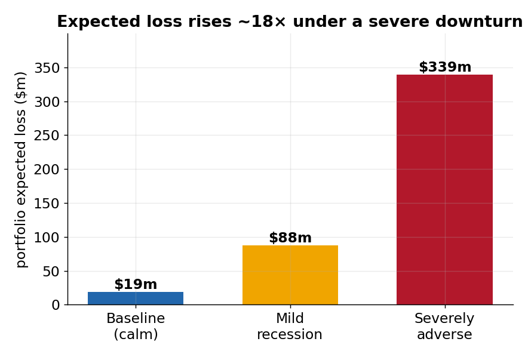
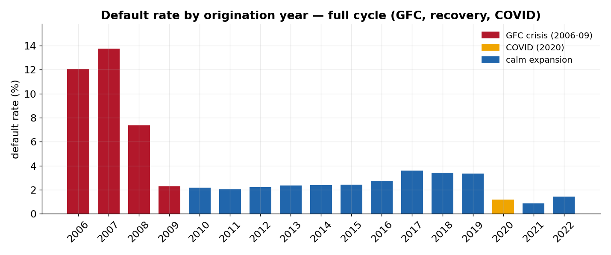
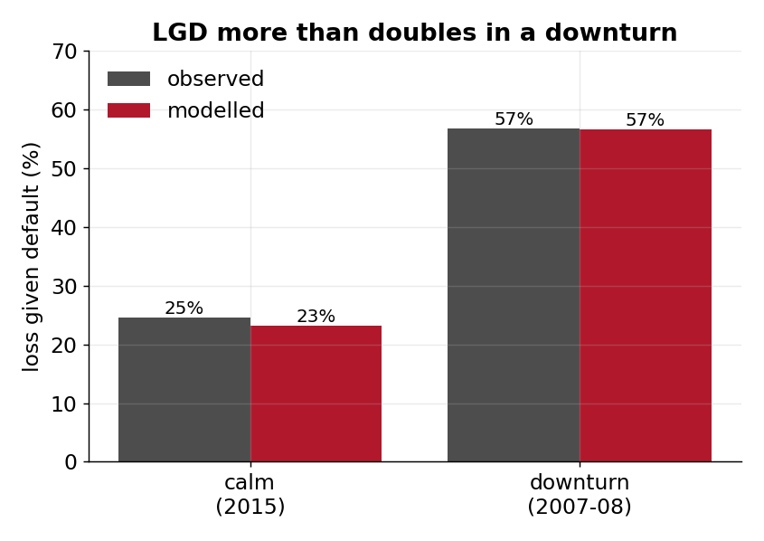
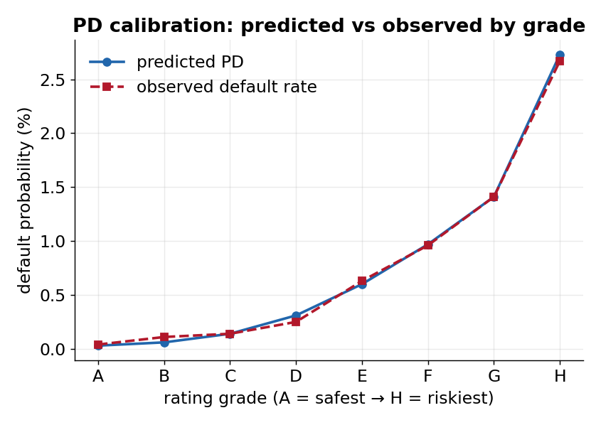
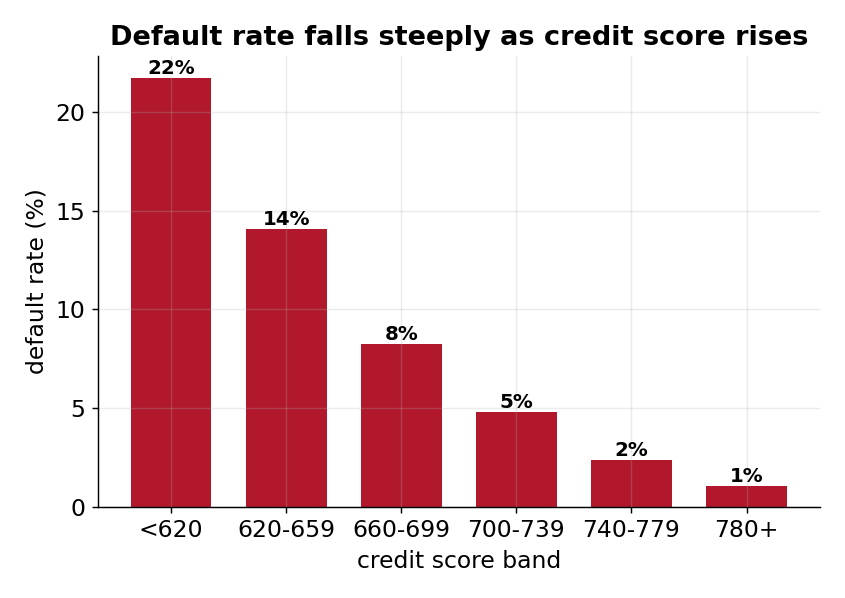

# Mortgage Credit Risk — PD + LGD + EAD + Expected Loss + Stress Testing

> **In one line:** Built a complete mortgage credit-risk model on **~850,000 real US
> home loans across 17 origination years (2006–2022)** — estimating how likely each loan
> is to default (**PD**), how much money is actually lost when it does (**LGD**), and how
> much is owed at the time (**EAD**) — then combining them into **Expected Loss = PD × LGD
> × EAD**, staging it under IFRS 9 / AASB 9, and stress-testing the book across a **full
> economic cycle with two real downturns (the 2007–2009 financial crisis and the 2020
> COVID shock)**.

---

## For a non-technical reader: what is this, and why does it matter?

When a bank lends money for a home, it must set aside a sensible amount for loans
that will go bad. Getting that number right keeps the bank safe **and** keeps
loans affordable. The number is built from three questions:

| Question | Industry term | Plain meaning |
|---|---|---|
| Will the borrower stop paying? | **PD** (Probability of Default) | the *chance* of default |
| If they do, how much is lost? | **LGD** (Loss Given Default) | the *severity* of the loss after the house is sold |
| How much was still owed? | **EAD** (Exposure at Default) | the *amount* at risk |

Multiply them and you get **Expected Loss = PD × LGD × EAD** — the money a lender
should expect to lose. This project estimates all three on real mortgages,
combines them, sorts the loans into the accounting buckets banks must report
(IFRS 9 / AASB 9), and then stress-tests the book against a recession.

**The standout piece** is the LGD: instead of *assuming* a loss rate (as many
projects do), it is **measured from Freddie Mac's real, settled loss records** and
independently validated.

---

## Headline results

**Across a full cycle, the downturn cohorts are dramatically worse than the calm
expansion — on both how often loans default and how much is lost each time — and the
two downturns have *different shapes*.**

| Period (origination) | Default rate (ever) | Avg loss-given-default | Character |
|---|---|---|---|
| **GFC crisis** (2006–2008) | **7–14%** | **54–58%** | high default **and** high severity |
| **Recovery** (2009–2014) | ~2% | 34–42% | low default, easing severity |
| **Calm expansion** (2015–2019) | 2–4% | 18–25% | the benign baseline |
| **COVID-2020** | **1.2%** (forbearance-suppressed) | ~27% | high *risk*, **mild** severity |

- **PD model** discriminates well (test **AUC 0.83 / Gini 0.65 / KS 0.50**); grades
  calibrated to a **count-weighted long-run average across all 17 vintages**; passes a
  forward **cold holdout** (train 2006–2019 → score the never-seen 2020–2022 loans).
- **LGD** matches Freddie Mac's own loss field at **0.99 correlation**; downturn (GFC)
  **~56.5%** versus **~34%** outside it — measured, not assumed.
- **Portfolio Expected Loss** ~**$236m** on a 12-month basis (12.3 bps of $192bn exposure),
  rising to ~**$323m** once IFRS 9 staging applies lifetime ECL to Stages 2 and 3.
- **Stress (two real downturns):** a severe GFC scenario lifts EL **~13×**; the observed
  **COVID-2020 shape ~4.7×** — high default (PD ×4.3) but mild severity (LGD ×1.1).

*Each result below is reproduced by the pipeline and saved to [outputs/tables/](outputs/tables/);
every notebook explains itself in plain English first, then shows the code and the table.*

---

## 1. Data coverage and input data

**Years covered.** 17 origination vintages, **2006–2022** (no 2005 in the public sample
set), 50,000 loans each = **~850,000 loans**, with monthly performance observed through
**2025-09** — so even the 2022 book has 3+ years of history and the one-year PD window is
fully observable for every vintage.

**Source.** The Freddie Mac **Single-Family Loan-Level Dataset (SFLLD)** — a public US
mortgage dataset of fixed-rate, fully-amortising single-family loans. Two pipe-delimited
files per vintage, with **no column headers**: an **origination** file (one row per loan)
and a **monthly performance / servicing** file (one row per loan per month, tens of
millions of rows). Downloaded via Freddie Mac Clarity Data Intelligence; **raw data is not
redistributed in this repo**. Source: <https://freddiemac.com/research/datasets/sf-loanlevel-dataset>

**Key raw variables used.**

| From the origination file | From the monthly performance file |
|---|---|
| `credit_score`, `original_ltv`, `original_cltv`, `original_dti` | `monthly_reporting_period`, `loan_age` |
| `original_upb` (loan amount), `original_interest_rate` | `current_actual_upb` (running balance) |
| `original_loan_term`, `number_of_borrowers` | `current_loan_delinquency_status` |
| `loan_purpose`, `occupancy_status`, `channel` | `zero_balance_code` + `zero_balance_effective_date` |
| `property_type`, `property_state`, `mi_pct` | `net_sales_proceeds`, `mi_recoveries`, `non_mi_recoveries` |
| | `expenses`, `delinquent_accrued_interest`, `actual_loss_calculation` |

**Data cleaning, transformation and feature engineering.**

- **Layout safety** — the official 32-column SFLLD layout is applied in
  [src/layout.py](src/layout.py) and the column count is **asserted before any names are
  attached**, so a wrong mapping can never silently corrupt the numbers.
- **Sentinel handling** — SFLLD "missing" codes are mapped to NA (`credit_score` 9999,
  `original_dti` 999, `original_cltv`/`original_ltv` 999); delinquency text codes (`R`/`RA`
  for REO) are parsed to numbers, blanks/`XX` to NA; money fields carrying letters (`C`/`U`)
  are stripped before any arithmetic.
- **Loss-field fix (a real finding)** — the aggregate `expenses` field *exactly equals* the
  sum of its four sub-components and all are stored **negative**; naively adding them
  double-counts costs. Using the aggregate **once**, with the correct sign, is what makes the
  computed loss reconcile to Freddie Mac's own `actual_loss_calculation` at **0.99
  correlation** (documented in notebook 01).
- **Collapse to loan level** — the monthly file is reduced to one row per loan: default
  flag + date, balance at default, and the one-time loss/recovery components.
- **Engineered targets / features** — `default_within_12m` (one-year PD target),
  `ever_default` (lifetime), realised/economic/APRA LGD, EAD, a documented **regime
  classifier** (GFC 2006–09 / COVID 2020 / calm), and a WOE/IV points transformation for the
  scorecard. → [Data-quality + seasoning summary](outputs/tables/00_data_quality.csv)

---

## 2. PD model — methodology and results

### Methodology (plain English)

**What it answers:** *what is the chance this loan defaults in the next 12 months?*

- **Default definition** — a loan is in default the first month it is **180+ days past due**
  (delinquency status ≥ 6) **or** ends in a credit-event zero-balance code (third-party sale,
  short sale / charge-off, REO disposition, note sale). A prepaid/matured loan is **not** a
  default. (A 90-DPD sensitivity is also built for the APS 220 broad-equivalence check.)
- **Target** — `default_within_12m`: a default in the **first 12 months** of the loan's life.
  A fixed window puts all 17 vintages on the same footing (the framework's one-year-PD basis,
  CRE36.63 / APS 113 Att D PD para 2).
- **Approach** — an interpretable **logistic regression** on **origination features only**
  (a clean "through-the-door" scorecard), standardised before fitting. The continuous score
  is then turned into a **WOE/IV points scorecard** and loans are sorted into **8 rating
  grades A (safest) → H (riskiest)**, each calibrated to its **count-weighted long-run
  one-year default rate** across the 17 vintages, with a **margin of conservatism**, a
  **revise-upward ratchet**, and the **5 bps regulatory floor**.

### Results — the final model equation

The logistic coefficients (standardised, so directly comparable; `exp(coef)` = odds
multiplier per 1-SD move) → [03_pd_coefficients.csv](outputs/tables/03_pd_coefficients.csv):

| Variable | Coefficient | Odds ×/1 SD | Direction |
|---|---:|---:|---|
| intercept | −6.30 | — | base rate ~0.4% |
| **credit_score** | **−0.64** | 0.53 | higher score → **much lower** default *(strongest driver)* |
| original_dti | +0.37 | 1.45 | higher debt-to-income → higher default |
| original_interest_rate | +0.33 | 1.39 | higher rate (risk-priced) → higher default |
| original_loan_term | +0.29 | 1.34 | longer term → higher default |
| original_ltv | +0.23 | 1.26 | higher loan-to-value → higher default |
| original_cltv | +0.14 | 1.15 | higher combined LTV → higher default |
| *loan_purpose / occupancy / channel* | ±0.09 or less | ~1.0 | small categorical adjustments |

Every sign is economically intuitive — credit score dominates and is protective; leverage
(LTV/CLTV), affordability (DTI) and price (rate) all add risk.

### Results — rating grades & scorecard

The **master scale** — predicted vs actually-observed default rate per grade
→ [03b_master_scale.csv](outputs/tables/03b_master_scale.csv):

| Grade | Loans | Predicted PD | Observed | Long-run PD (calibrated) |
|---|---:|---:|---:|---:|
| A | 98,247 | 0.03% | 0.04% | 0.05% |
| B | 114,153 | 0.06% | 0.07% | 0.07% |
| C | 105,933 | 0.11% | 0.09% | 0.09% |
| D | 106,462 | 0.20% | 0.20% | 0.20% |
| E | 105,591 | 0.33% | 0.39% | 0.37% |
| F | 106,384 | 0.47% | 0.41% | 0.40% |
| G | 103,959 | 0.69% | 0.71% | 0.65% |
| H | 109,271 | 1.22% | 1.17% | 1.09% |

Predicted and observed sit almost on top of each other and rise in order — the scorecard
both **ranks** and **sizes** risk. Grades G/H are flagged by the binomial calibration test
and **ratcheted up** to at least their realised rate (APS 113 Validation para 6).
→ [calibration test](outputs/tables/03d_pd_calibration_test.csv) · [MoC + 5 bps floor](outputs/tables/03e_grade_pd_moc_floor.csv)

### Results — validation

| Test | Result | Source |
|---|---|---|
| **Discrimination** (held-out) | **AUC 0.83 · Gini 0.65 · KS 0.50** | [03_pd_metrics.csv](outputs/tables/03_pd_metrics.csv) |
| **Calibration** | predicted vs observed track the diagonal | [chart](outputs/charts/pd_calibration.png) |
| **Confusion matrix** (at the prevalence cut-off 0.39%) | recall **0.75** (caught 743/986 defaults), low precision as expected for a ~0.4% base rate | [03_confusion_matrix.csv](outputs/tables/03_confusion_matrix.csv) |
| **Out-of-time / out-of-regime** | rank-ordering travels across regimes; level/stability is regime-sensitive (PSI) | [03c_oot_validation.csv](outputs/tables/03c_oot_validation.csv) |
| **Forward cold holdout** (train 2006–2019 → test 2020–2022) | test **AUC 0.71**, predicted PD 0.21% vs observed 0.36%, **PSI 0.16 (stable)** | same |

The **forward holdout** is the honest production test — the model is fitted on the past and
scored on genuinely later loans (including COVID) it has never seen, and it still
rank-orders them.

### Stressed PD (the PD half of the stress test)

The calibrated PD is stressed two ways:

| Method | Severe scenario | Mild / COVID |
|---|---|---|
| **Observed multipliers** (notebook 07) | PD **×5.7** (portfolio 0.40% → **2.2%**) | mild ×2.6 · COVID ×4.3 |
| **Macro-credit satellite model** ([stress_test/](stress_test/)) | PD **×24.7** (simultaneous-shock upper bound, triangulated to the observed ceiling ×7.8) | mild ×5.4 |

The satellite model estimates `logit(default rate) ~ unemployment + house prices + GDP` from
79 quarters of data and is driven by the recession scenario — **unemployment is the dominant
driver**. Its macro coefficients give a **systematic log-odds shift** that is applied to *each
rating grade* to produce **stressed PD per grade and grade migration** (e.g. mild recession:
A 0.05%→0.27% (→ D), H 1.17%→6.1%; severe: a mass downgrade toward H) — see
[scenario_stressed_pd_by_grade.csv](stress_test/outputs/tables/scenario_stressed_pd_by_grade.csv).
It deliberately runs hotter than the observed ceiling in the joint tail (see the
[stress_test README](stress_test/README.md) for the triangulation and model-risk controls).

---

## 3. LGD model — methodology and results

### Methodology (plain English)

**What it answers:** *if this loan defaults, what fraction of the exposure is actually lost?*

- **LGD definition** — economic loss ÷ EAD, built from **real settled loss records**, not an
  assumption. Realised loss = `EAD + delinquent accrued interest − expenses − (net sales
  proceeds + MI recoveries + non-MI recoveries)`, capped to `[0, 1.10]`; this is the
  **0.99-reconciliation anchor**. An **economic (discounted)** variant (`lgd_econ`) discounts
  the recovery from disposition back to default, and a separate **APRA capital view**
  (`lgd_apra`) excludes mortgage-insurance recoveries, applies the 20% high-LVR reduction and
  the **20% floor** — kept strictly apart from the IFRS 9 figures.
- **Approach** — a transparent **two-stage ("hurdle") model** on defaulted, **disposed** loans
  (the only ones with a settled loss): **Stage 1** a logistic regression for *whether* there
  is a material loss, **Stage 2** a regression for *how big* the loss is. LGD = P(loss) ×
  severity. Because severity is **cyclical** (GFC ≈1.6× the rest), the **downturn LGD** is the
  estimate used for capital/EL (APS 113 Att D LGD paras 4–5).

### Results — model variables, coefficients & key drivers

→ [04_lgd_coefficients.csv](outputs/tables/04_lgd_coefficients.csv) (variables: original LTV,
credit score, loan size, and the GFC-downturn flag):

| Stage | Variable | Coefficient | Reading |
|---|---|---:|---|
| **1 — P(loss) logistic** | **downturn flag** | **+1.61** | **the dominant driver** — a default in the GFC era is far more likely to crystallise a loss |
| | original_ltv | +0.009 | higher LTV → more likely a loss |
| | credit_score | +0.001 | small |
| **2 — severity linear** | **downturn flag** | **+0.18** | a GFC-era loss is ~18 LGD-points more severe |
| | original_ltv | −0.0004 | small |
| | credit_score | −0.0003 | small |

**Key driver of loss severity = the downturn/collateral environment**, not the individual
borrower — exactly the cyclical signature a downturn LGD is meant to capture.

### Results — predicted LGD by regime and segment

By **regime** → [04_lgd_model.csv](outputs/tables/04_lgd_model.csv):

| Regime | Disposed defaults | Observed LGD | Modelled LGD | Economic LGD | APRA-view LGD |
|---|---:|---:|---:|---:|---:|
| downturn (GFC) | 11,222 | **56.5%** | 56.5% | 61.9% | 63.2% |
| calm / other | 2,244 | 34.2% | 33.6% | 38.5% | 43.1% |
| all | 13,466 | 52.8% | 52.7% | 58.0% | 59.9% |

By **LTV band** (realised vs predicted, an independent calibration segment)
→ [04b_lgd_calibration_by_segment.csv](outputs/tables/04b_lgd_calibration_by_segment.csv):
the model tracks realised severity across LTV with no systematic bias (gaps −0.05 to +0.08).

### Results — validation

| Test | Result | Source |
|---|---|---|
| **Reconciliation** | computed loss vs Freddie Mac's own loss field: **0.99 correlation** | notebook 01 |
| **Out-of-time / out-of-regime** | trained on calm only **under-predicts** the crisis (21% vs 57%) — a model built in good times is blind to a downturn | [04b_lgd_validation.csv](outputs/tables/04b_lgd_validation.csv) |
| **Forward cold holdout** (train pre-2020 → test 2020–22) | predicted **0.329** vs realised **0.321** (n=65, thin but on the money) | same |
| **Cohort backtest** | predicted-decile means track realised | same |
| **Discrimination** | Spearman 0.33 (LGD is inherently noisy → modest R²) | same |
| **Stability** | dropping any single vintage moves mean LGD only modestly | same |
| **Benchmarking** | downturn ~56% sits within published US GFC severities (~40–60%); calm ~34% and APRA 20% floor bracket it | [04b_lgd_benchmarking.csv](outputs/tables/04b_lgd_benchmarking.csv) |

### Stressed LGD (the LGD half of the stress test)

Severity is **collateral-driven**, so it is stressed through the house-price shock, anchored to
the **measured** regimes above:

| Scenario | Stressed LGD | Multiplier | Driver |
|---|---:|---:|---|
| **baseline** (calm) | ~34% | ×1.0 | calm/other regime |
| **severe** (house prices −25%) | ~56% | **×2.3** | GFC downturn LGD (measured) |
| **COVID-2020** | ~27% | **×1.1** | high default but **mild** severity (house prices *rose*) |

This is the key asymmetry the project surfaces: a downturn raises **both** PD and LGD (they
stack with no diversification offset, APG 113 para 92), **except** COVID, where LGD barely
moved. In the [satellite stress test](stress_test/), stressed LGD is scaled continuously by the
scenario's property-price fall between these calm and downturn anchors.

---

## 4. EAD model — methodology and results

### Methodology (plain English)

**What it answers:** *how much is owed at the moment of default?*

- **EAD definition** — for a mortgage, simply the **outstanding balance at default**
  (`current_actual_upb` at the first default month, plus any deferred balance; falling back to
  the balance removed at disposition where the credit-event row shows zero).
- **No credit-conversion factor (CCF)** — a term mortgage is **fully drawn on day one and has
  no undrawn limit**, so there is nothing to convert (unlike a credit card, which would need a
  CCF on its undrawn line). This is **supervisory EAD** territory: own-EAD estimates are
  mandatory only for *revolving* retail, so the absence of a CCF is correct-by-design, not a
  gap. EAD is floored at the current drawn balance, and post-default drawings flow to LGD, not
  EAD.

### Results

Exposure at default by vintage → [05_ead_summary.csv](outputs/tables/05_ead_summary.csv):
mean EAD rises from **~$179k (2006)** to **~$295k (2022)**, tracking house-price growth
rather than risk — EAD is a *balance*, not a risk gauge. Across the portfolio the
exposure base is **~$192bn**.

**How EAD feeds Expected Loss:** for every loan, the exposure used in EL is the balance at
default if the loan defaulted, otherwise the original loan amount as the exposure proxy for a
still-performing loan — so EAD is the dollar amount that multiplies PD × LGD in §5.

---

## 5. Expected Loss — methodology and results

### Methodology (plain English)

**Expected Loss = PD × LGD × EAD**, computed **per loan** and then summed. The PD used is the
**calibrated capital grade PD** (long-run average + MoC + ratchet + floor), so the dollar loss
reconciles to the master scale and the capital number (EL framework Part 5.1). Loans are then
sorted into **IFRS 9 / AASB 9 stages** — Stage 1 (performing, 12-month ECL), Stage 2
(significant increase in risk, lifetime ECL), Stage 3 (defaulted, lifetime ECL on a Stage-3
best-estimate basis).

### Results — by rating grade and portfolio total

→ [06_el_summary_by_grade.csv](outputs/tables/06_el_summary_by_grade.csv):

| Grade | Loans | Total EAD | Avg PD | Avg LGD | 12-mo Expected Loss | EL rate (bps) |
|---|---:|---:|---:|---:|---:|---:|
| A | 98,247 | $21.4bn | 0.05% | 33.8% | $3.1m | 1.4 |
| B | 114,153 | $25.9bn | 0.08% | 33.2% | $5.8m | 2.2 |
| C | 105,933 | $25.0bn | 0.11% | 33.6% | $7.8m | 3.1 |
| D | 106,462 | $24.7bn | 0.22% | 34.3% | $15.8m | 6.4 |
| E | 105,591 | $24.6bn | 0.40% | 35.3% | $29.2m | 11.9 |
| F | 106,384 | $22.5bn | 0.43% | 36.6% | $30.2m | 13.4 |
| G | 103,959 | $23.3bn | 0.71% | 36.7% | $52.0m | 22.3 |
| H | 109,271 | $24.8bn | 1.17% | 36.7% | $92.1m | 37.1 |
| **PORTFOLIO** | **850,000** | **$192.3bn** | **0.40%** | **35.0%** | **$235.9m** | **12.3** |

The EL rate climbs **1.4 → 37 bps** from grade A to H — risk-sized exactly as a rating scale
should be, driven almost entirely by PD (LGD is broadly flat across grades because severity is
collateral/cycle-driven, not borrower-grade-driven).

### Results — by IFRS 9 stage

→ [06_expected_loss.csv](outputs/tables/06_expected_loss.csv):

| Stage | Loans | Avg PD | Avg LGD | Total EAD | 12-month EL | Reported ECL (staged) |
|---|---:|---:|---:|---:|---:|---:|
| 1 — performing | 790,987 | low | 35% | $180.2bn | $206.8m | $206.8m (12-month) |
| 2 — significant ↑ in risk | 26,205 | — | 38% | $5.5bn | $11.3m | $45.2m (lifetime) |
| 3 — defaulted | 32,808 | — | 44% | $6.5bn | $17.8m | $71.2m (lifetime) |

Portfolio **12-month EL ≈ $236m**, rising to **≈ $323m** once IFRS 9 lifetime ECL applies to
Stages 2 and 3.

### Results — stress

→ [07_stress_test.csv](outputs/tables/07_stress_test.csv): on the calm baseline book, a
**severe GFC** scenario lifts EL **~13×** (PD ×5.7, LGD ×2.3 stacking with no diversification
offset), while the **observed COVID-2020** scenario lifts it **~4.7×** (PD ×4.3 but LGD ×1.1)
— two empirically-grounded downturns of very different shape.

> **Statistical stress test (satellite model).** Notebook 07 uses the *observed-multiplier*
> method. A separate **[stress_test/](stress_test/)** module implements the bank-grade
> *statistical* approach — a **macro-credit satellite model** that estimates `logit(default
> rate) ~ unemployment + house prices + GDP` from 79 quarters of data (GFC + COVID), then
> drives it with recession scenarios. See [stress_test/README.md](stress_test/README.md) for
> the methodology, validation, and a model-risk triangulation of the tail.

#### Where the stress-test macro data comes from, and how it enters the model

The macro drivers **do not come from the Freddie Mac data** — that data supplies the *dependent*
variable (the default rate); the drivers are an **external overlay** of public US series, held in
[stress_test/macro/macro_annual.csv](stress_test/macro/macro_annual.csv):

| Driver | Real-world source (FRED series) |
|---|---|
| unemployment rate (%) | `UNRATE` |
| house-price growth YoY (%) | `CSUSHPINSA` (Case-Shiller) |
| real GDP growth (%) | `A191RL1Q225SBEA` |
| 30-yr mortgage rate (%) | `MORTGAGE30US` |

*(Committed values are approximate public figures so it runs offline;
[fetch_macro_fred.py](stress_test/fetch_macro_fred.py) refreshes them from FRED.)*

They enter the model by a **calendar-time join** — each quarter's default rate (from the loans) is
paired with that same quarter's macro (from the CSV), then standardised and regressed:

```text
macro_annual.csv ──interpolate to quarterly──┐
                                             merge on calendar quarter ──► logit(default_rate)
loan_level.parquet ──quarterly default rate──┘                            ~ β·[unemp, ΔHPI, GDP, age]
```

So: **(1)** read the annual macro CSV and interpolate to quarterly; **(2)** build the quarterly
default rate from the loan panel; **(3)** join the two by calendar quarter (bad macro lines up with
high observed default); **(4)** standardise and regress to get the coefficients; **(5)** for a
scenario, feed its macro values back through the fitted model → stressed PD. Full detail in
[stress_test/README.md §2](stress_test/README.md).

---

## Key charts

*All charts regenerate from the committed pipeline outputs by
[tools/make_figures.py](tools/make_figures.py) — aggregated results only, no raw loan records.*

### 1. Expected loss: baseline vs stressed

The calm-book EL (~$11m) versus a mild recession (~$38m) and a severe GFC-calibrated downturn
(~$138m) — losses jump because PD and LGD worsen *together*.

### 2. Default rate by origination year (full 2006–2022 cycle)

The GFC cohorts (2006–09) and COVID (2020) stand out from the calm expansion — a real
observed cycle, colour-coded by regime.

### 3. Loss given default: downturn vs calm

Severity measured from real settled losses, and the model's match to it.

### 4. PD calibration by rating grade

Predicted and observed lines sit almost on top of each other and rise in order.

### 5. Default rate by credit score

Risk falls steeply and smoothly as scores rise — textbook behaviour that confirms the data
and definitions are right.

---

## How the build is organised (one notebook per step)

| # | Notebook | Produces |
|---|---|---|
| 00 | [Load & assemble](notebooks/00_load_and_assemble.ipynb) | [data quality + seasoning](outputs/tables/00_data_quality.csv) |
| 01 | [Base table](notebooks/01_base_table.ipynb) — default, EAD, realised LGD (0.99 reconcile) | [default & LGD by vintage](outputs/tables/01_default_lgd_by_vintage.csv) |
| 02 | [EDA](notebooks/02_eda.ipynb) | [risk by driver](outputs/tables/02_risk_by_driver.csv) |
| 03 | [PD model](notebooks/03_pd_model.ipynb) — logistic, coefficients, confusion | [metrics](outputs/tables/03_pd_metrics.csv) · [coefficients](outputs/tables/03_pd_coefficients.csv) · [confusion](outputs/tables/03_confusion_matrix.csv) |
| 03b | [PD scorecard](notebooks/03b_PD_Scorecard.ipynb) — grades, master scale, calibration, MoC, floor | [master scale](outputs/tables/03b_master_scale.csv) · [MoC+floor](outputs/tables/03e_grade_pd_moc_floor.csv) |
| 03c | [PD OOT validation](notebooks/03c_PD_OutOfTime_Validation.ipynb) — incl. forward cold holdout | [OOT](outputs/tables/03c_oot_validation.csv) |
| 04 | [LGD model](notebooks/04_lgd_model.ipynb) — two-stage, coefficients, downturn, economic & APRA views | [LGD model](outputs/tables/04_lgd_model.csv) · [coefficients](outputs/tables/04_lgd_coefficients.csv) |
| 04b | [LGD validation](notebooks/04b_LGD_Validation.ipynb) — OOT, forward holdout, LTV calibration, benchmarking | [validation](outputs/tables/04b_lgd_validation.csv) · [LTV calibration](outputs/tables/04b_lgd_calibration_by_segment.csv) · [benchmarking](outputs/tables/04b_lgd_benchmarking.csv) |
| 05 | [EAD](notebooks/05_ead.ipynb) | [EAD summary](outputs/tables/05_ead_summary.csv) |
| 06 | [Expected Loss](notebooks/06_expected_loss.ipynb) — EL = PD×LGD×EAD, by grade/stage, IFRS 9 | [EL by stage](outputs/tables/06_expected_loss.csv) · [EL by grade](outputs/tables/06_el_summary_by_grade.csv) |
| 07 | [Stress testing](notebooks/07_stress_testing.ipynb) — severe GFC + observed COVID | [stress](outputs/tables/07_stress_test.csv) |
| 08 | [Documentation & monitoring](notebooks/08_documentation_and_monitoring.ipynb) — model pack + PSI | [PSI](outputs/tables/08_monitoring_psi.csv) |

---

## Regulatory alignment (APS 113 / APG 113 / Basel / WP14 / IFRS 9)

The build is mapped to the APRA/Basel IRB and IFRS 9 frameworks; the per-model sections above
state where each rule is applied. In brief: **one-year PD** calibrated to a **count-weighted
long-run average** with MoC and the 5 bps floor; **economic + downturn LGD** with the APRA
floor/MI rules kept separate from IFRS 9; **supervisory EAD** (no CCF) for a term product; EL
on the **same PD as capital**, staged under IFRS 9. The **observation window now spans 17
vintages (2006–2022)** — a full cycle with two downturns — so the 5-year PD/retail-LGD minimum
is comfortably met. **Documentation-only** items (stated in notebook 08): rating philosophy,
override policy, use test, dev/validation independence, cure/probation rules, the 180-vs-90-DPD
default-definition equivalence, a lifetime-PD term structure (horizon-factor proxy), and the
recent-vintage incomplete-workout caveat.

## Limitations

- Portfolio **demonstration**, not a production or certified regulatory-capital model; the
  APRA-view overlays are illustrative applications of the rules.
- US agency mortgages — **not** an Australian / APRA IRB portfolio.
- Sample data (50k loans/vintage, ~850k total); illustrative calibration.
- Macro stress is scenario-based (GFC- and COVID-calibrated multipliers), not a fitted model.
- Recent-vintage (2021–2022) LGD workouts are not yet fully resolved (incomplete-workout caveat).

## How to run

```bash
pip install -r requirements.txt
# Place the SFLLD samples under "data/raw data/" — either as sample_orig_YYYY.txt +
# sample_svcg_YYYY.txt directly, or in per-vintage sample_YYYY/ subfolders (both work),
# for origination years 2006–2022.
python build_notebooks.py     # (re)generate the notebooks
python run_notebooks.py all   # execute 00–08; writes tables to outputs/tables/
python tools/make_figures.py  # regenerate the README charts
```
Notebook 00 does the heavy assembly of all 17 vintages once (~10 min) and caches a loan-level
table; the rest run in seconds off the cache.

## Repo structure

```
.
├── data/raw data/        # SFLLD files (2006–2022, 17 vintages) — GITIGNORED, never committed
├── data/processed/       # cached loan-level tables — GITIGNORED, regenerated by nb 00-01
├── notebooks/            # ordered build 00–08 (+ 03b scorecard, 03c PD validation, 04b LGD validation)
├── outputs/tables/       # CSV result snapshots (committed)  ·  outputs/charts/ — PNGs (committed)
├── src/                  # layout, loaders, definitions, models, metrics, woe, transform, scorecard
├── build_notebooks.py    # regenerates the notebooks
├── run_notebooks.py      # executes the notebooks end-to-end
└── tools/make_figures.py # regenerates the charts
```

## Skills this project demonstrates

- **Full Expected Credit Loss chain** — PD, LGD, EAD, EL, IFRS 9 / AASB 9 staging, stress.
- **Real loss modelling** — LGD built and validated from actual settled losses, not an assumption.
- **Data engineering at scale** — tens of millions of monthly rows across 17 vintages into a
  clean loan-level table.
- **Interpretable modelling** — logistic regression, a WOE/IV points scorecard with rating
  grades, and a transparent two-stage LGD — methods a reviewer and a regulator can follow.
- **Model validation & governance** — reconciliation to ground truth, AUC/Gini/KS, calibration,
  confusion matrix, forward cold holdout, PSI monitoring, and a written model-development pack.

## Relationship to my consumer-credit project

A **separate** project from my Home Credit (consumer credit) repo. Its reason for existing is
the one thing the consumer project could not do: a **real, modelled LGD from actual loss data**,
plus a genuine observed downturn. Where the consumer card project uses a CCF for undrawn limits,
this term-mortgage project deliberately does not — a point, not a gap.

## License

Released under the MIT License — free to read, run, and reuse with attribution.
